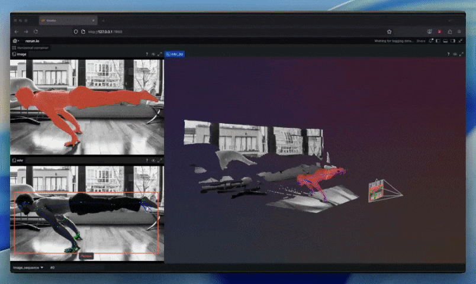
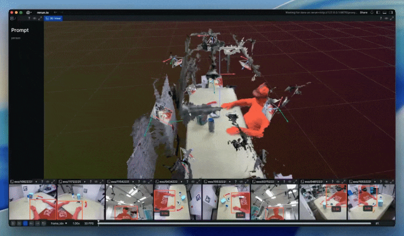

# SAM3D Body with Rerun
An unofficial playground for Meta's SAM3D Body (DINOv3) with promptable SAM3 masks and live Rerun visualization. Uses **Rerun** for 3D inspection, **Gradio** for the UI, and **Pixi** for one-command setup.

<p align="center">
  <a title="Rerun" href="https://rerun.io" target="_blank" rel="noopener noreferrer">
    
  </a>
  <a title="Pixi" href="https://pixi.sh/latest/" target="_blank" rel="noopener noreferrer">
    
  </a>
  <a title="CUDA" href="https://developer.nvidia.com/cuda-toolkit" target="_blank" rel="noopener noreferrer">
    
  </a>
  <a title="GitHub" href="https://github.com/rerun-io/sam3d-body-rerun" target="_blank" rel="noopener noreferrer">
    
  </a>
</p>

<p align="center">
  <!-- Drop your GIF/MP4 here once ready -->
  
</p>

## Installation
### Using Pixi
Make sure you have the [Pixi](https://pixi.sh/latest/#installation) package manager installed.

TL;DR install Pixi:
```bash
curl -fsSL https://pixi.sh/install.sh | sh
```
Restart your shell so the new `pixi` binary is on `PATH`.

This is Linux only with an NVIDIA GPU.

The SAM3 and SAM3D Body checkpoints are gated on Hugging Face—request access for both [facebook/sam-3d-body-dinov3](https://huggingface.co/facebook/sam-3d-body-dinov3) and [facebook/sam3](https://huggingface.co/facebook/sam3), then authenticate either by setting `HF_TOKEN=<your token>` or running `huggingface-cli login` before the first download (see Meta's install notes).

First run will download HF checkpoints for SAM3, SAM3D Body, and the relative-depth model.
```bash
git clone https://github.com/rerun-io/sam3d-body-rerun.git
cd sam3d-body-rerun
pixi run app
```

All commands can be listed with `pixi task list`.

## Usage
### Gradio App
```bash
pixi run app
```
Opens the Gradio UI with an embedded streaming Rerun viewer. Try the bundled samples in `data/example-data` or upload your own RGB image; toggle “Log relative depth” to stream predicted depth.

### CLI
From a dev shell (for tyro + dev deps):
```
pixi run cli
```

OR

```bash
pixi shell -e dev
python tool/demo.py --help
```
Run on a folder of images and configure Rerun output/recordings via the CLI flags.

### Promptable SAM3 sandbox
If you just want SAM3 masks without 3D reconstruction:
```bash
pixi run -e dev python tool/gradio_sam3.py
```

### Multiview Video Demo
Process multiview HoCap video sequences with SAM3 segmentation and TSDF mesh fusion:
```bash
pixi run mv-video-demo
```
Downloads sample data (~1.7GB) on first run and processes 100 frames across 8 cameras, visualizing segmentation overlays and a fused 3D mesh in Rerun. Requires ~3GB VRAM.

<p align="center">
  
</p>

## Acknowledgements
Thanks to the original projects that make this demo possible:

- [facebook/sam-3d-body-dinov3](https://huggingface.co/facebook/sam-3d-body-dinov3) — SAM3D Body checkpoints and assets.
- [facebook/sam3](https://huggingface.co/facebook/sam3) — promptable concept segmentation.
- Relative depth/FOV from `MogeV1Predictor` in [monopriors](https://github.com/pablovela5620/monoprior).
- Built with [Rerun](https://rerun.io/), [Gradio](https://www.gradio.app/), and [Pixi](https://pixi.sh/latest/).

Dual licensed under Apache 2.0 and MIT for the code in this repository; upstream models/assets retain their original licenses (see `LICENSE-APACHE` and `LICENSE-MIT` for this repo).
